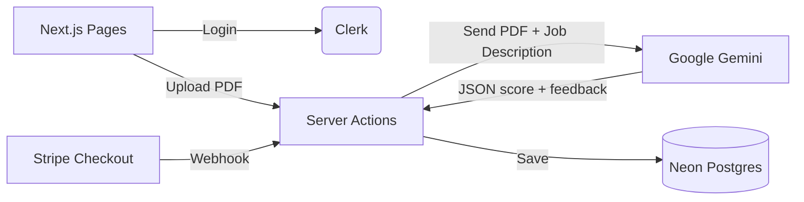

# HireSense - AI Powered Applicant Tracking System

A B2B SaaS app that helps recruiters screen resumes automatically. A recruiter creates a job,
uploads candidate resumes as PDF, and Google Gemini reads the resume against the job
description and returns a match score with strengths, weaknesses and red flags.

## How it works



## Tech Stack

- **Next.js 16 (App Router)** - frontend and backend in one project
- **React 19** - UI
- **Tailwind CSS v4** - styling
- **Clerk** - authentication and Google login
- **Prisma + Neon Postgres** - database
- **Google Gemini** - reads the PDF resume and scores it
- **Stripe** - subscription payments

Written in plain JavaScript. No TypeScript, no UI component library.

## Features

**AI resume screening** - The PDF is sent straight to Gemini as base64, no text extraction
library in between. The prompt forces the model to reply with a JSON object containing a
score out of 100, a summary, strengths, missing requirements, jargon and red flags.

**Multi tenant data** - Every job stores the `clerkUserId` of the recruiter who created it.
All queries filter by that id, so two recruiters never see each other's data.

**Subscription plans** - Free (3 scans), Plus (50 scans/month) and Pro (200 scans/month).
Stripe Checkout creates the subscription and a signed webhook updates the plan in the
database. The scan limit is checked before every AI call.

## Project structure

```
prisma/schema.prisma          database tables
src/middleware.js             protects the dashboard routes
src/lib/prisma.js             database connection
src/lib/plans.js              scan limits and prices
src/lib/utils.js              small helpers
src/components/icons.jsx      inline svg icons
src/app/page.jsx              landing page
src/app/actions/              server actions (create job, analyze resume)
src/app/api/stripe/           checkout and webhook routes
src/app/dashboard/            overview, jobs, candidates, pricing
```

## Running it locally

```bash
git clone https://github.com/Saksham2410del/HireSense-AI-Applicant-Tracking-System.git
cd HireSense-AI-Applicant-Tracking-System
npm install
```

Create a `.env` file in the root (see `.env.example`):

```
DATABASE_URL="your_neon_postgres_url"
NEXT_PUBLIC_CLERK_PUBLISHABLE_KEY="your_clerk_pub_key"
CLERK_SECRET_KEY="your_clerk_secret_key"
GEMINI_API_KEY="your_gemini_api_key"
STRIPE_SECRET_KEY="your_stripe_secret_key"
STRIPE_WEBHOOK_SECRET="your_stripe_webhook_secret"
NEXT_PUBLIC_APP_URL="http://localhost:3000"
```

Push the tables and start the server:

```bash
npx prisma db push
npx prisma generate
npm run dev
```

Open http://localhost:3000

To test Stripe payments locally, forward the webhook:

```bash
stripe listen --forward-to localhost:3000/api/stripe/webhook
```

## License

MIT
