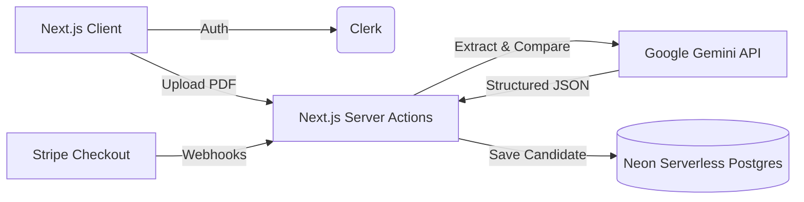

# HireSense: AI-Powered Applicant Tracking System

A complete B2B SaaS platform for automating technical recruitment and candidate screening. This project handles everything from secure recruiter authentication and role-based data isolation to parsing raw PDF resumes natively using Google Gemini to generate structured "Fit Scores" against job descriptions.

## Project Architecture



## Key Technologies

- **Frontend Application**: Next.js 15 (App Router), React, Tailwind CSS, Shadcn UI
- **Backend & API**: Next.js Server Actions, Node.js
- **Database & ORM**: Neon (Serverless PostgreSQL), Prisma
- **Authentication**: Clerk (Middleware-protected routes)
- **AI Integration**: Google Gemini API (Native PDF ingestion)
- **Monetization & Webhooks**: Stripe

## Overview

The goal of this project is to build a scalable, multi-tenant Applicant Tracking System (ATS) that drastically reduces the time technical recruiters spend manually screening resumes. Instead of relying on error-prone OCR text extractors, this pipeline passes raw PDF bytes directly to a multimodal AI to evaluate candidate fit, extract strengths and weaknesses, and flag grammatical errors.

## Core Features

1. **Automated AI Screening Pipeline**: Uses Google Gemini to ingest PDF resumes natively. A custom prompt forces the LLM to act as a strict technical recruiter, outputting a precise JSON object containing a 1-100 match score, key strengths, missing requirements, and red flags.
2. **Multi-Tenant Data Isolation**: Securely isolates data using Clerk authentication and Prisma. Every job and candidate is strictly tied to the `clerkUserId` of the recruiter who created it, ensuring total privacy across concurrent accounts.
3. **SaaS Monetization Engine**: Integrates Stripe Checkout for dynamic subscription tiers (Free, Plus, Pro). A securely verified Stripe webhook listener automatically updates the user's scan limits in the Postgres database upon successful payment.
4. **Modern UI**: Built using robust JavaScript (ES6+). The user interface leverages Tailwind CSS and Shadcn UI to deliver a clean, responsive, and highly accessible dashboard without heavy external component libraries.

## Local Development Setup

To run this project locally on your machine:

```bash
# 1. Clone the repository
git clone https://github.com/Saksham2410del/HireSense-AI-Applicant-Tracking-System.git
cd HireSense-AI-Applicant-Tracking-System

# 2. Install dependencies
npm install

# 3. Set up Environment Variables
# Create a .env file in the root directory and add your keys:
DATABASE_URL="your_neon_postgres_url"
NEXT_PUBLIC_CLERK_PUBLISHABLE_KEY="your_clerk_pub_key"
CLERK_SECRET_KEY="your_clerk_secret_key"
GEMINI_API_KEY="your_gemini_api_key"
STRIPE_SECRET_KEY="your_stripe_secret_key"
STRIPE_WEBHOOK_SECRET="your_stripe_webhook_secret"
NEXT_PUBLIC_APP_URL="http://localhost:3000"

# 4. Sync the Database Schema
npx prisma db push
npx prisma generate

# 5. Start the Application
npm run dev
```

You can now test the application by navigating to `http://localhost:3000`.

## License

MIT License. See `LICENSE` for details.
